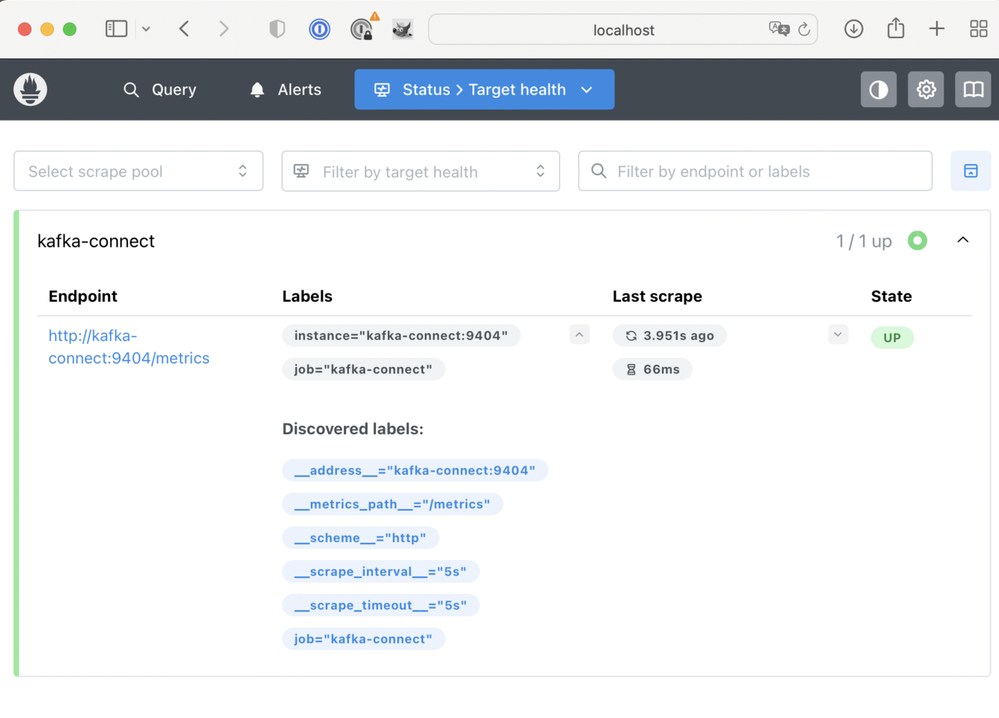

| Сервис             | URL                                            |
|--------------------|------------------------------------------------|
| Kafka UI           | [http://localhost:8080](http://localhost:8080) |
| Schema Registry    | [http://localhost:8081](http://localhost:8081) |
| Kafka Connect REST | [http://localhost:8083](http://localhost:8083) |
| PostgreSQL         | [http://localhost:5432](http://localhost:5432) |
| PostgreSQL         | [http://localhost:5432](http://localhost:5432) |
| Prometheus         | [http://localhost:9090](http://localhost:9090) |
| Grafana            | [http://localhost:3000](http://localhost:3000) |

```
PostgreSQL
   ↓
Debezium Connector
   ↓
Kafka Connect -> JMX Exporter -> Prometheus -> Grafana
   ↓
Apache Kafka Cluster (1 broker)
   ↓
Kafka UI
```

# Запуск Kafka-кластера и приложения
## Запуск Kafka-кластера
Запустите kafka кластер командой:
```
docker-compose -f docker-compose-kafka4.yml up -d
```

Файл `docker-compose-kafka4.yml` лежит в корне проекта.

Подождите 1–2 минуты, пока все сервисы запустятся.

## Debezium Connector
Настройки лежат в файле:
[debezium-postgres.json](../debezium-postgres.json)

Регистрация выполняется командой:
```
curl -X POST http://localhost:8083/connectors -H "Content-Type: application/json" -d "@debezium-postgres.json"
```

Проверить созданный коннектор можно командой:
```
curl http://localhost:8083/connectors
```

В ответе должно быть (поле `name` из файла настроек `debezium-postgres.json`):
```
["postgres-connector"]
```

Или еще проверить коннектор можно командой:
```
curl http://localhost:8083/connectors/postgres-connector/status
```

В ответе должно быть `"state":"RUNNING"`:
```
{"name":"postgres-connector","connector":{"state":"RUNNING","worker_id":"172.23.0.7:8083"},"tasks":[{"id":0,"state":"RUNNING","worker_id":"172.23.0.7:8083"}],"type":"source"}
```

После этого должны появиться топики:
- `postgres.public.users`
- `postgres.public.orders`

Топика для таблицы `logo` быть **НЕ** должно.

И в этих топиках должны появиться начальные сообщения о тех данных, что уже были в таблицах на момент регистрации коннектора, например:
```json
{
	"schema": {
		"type": "struct",
		"fields": [
			{
				"type": "struct",
				"fields": [
					{
						"type": "int32",
						"optional": false,
						"default": 0,
						"field": "id"
					},
					{
						"type": "string",
						"optional": true,
						"field": "name"
					},
					{
						"type": "string",
						"optional": true,
						"field": "email"
					},
					{
						"type": "int64",
						"optional": true,
						"name": "io.debezium.time.MicroTimestamp",
						"version": 1,
						"default": 0,
						"field": "created_at"
					}
				],
				"optional": true,
				"name": "postgres.public.users.Value",
				"field": "before"
			},
			{
				"type": "struct",
				"fields": [
					{
						"type": "int32",
						"optional": false,
						"default": 0,
						"field": "id"
					},
					{
						"type": "string",
						"optional": true,
						"field": "name"
					},
					{
						"type": "string",
						"optional": true,
						"field": "email"
					},
					{
						"type": "int64",
						"optional": true,
						"name": "io.debezium.time.MicroTimestamp",
						"version": 1,
						"default": 0,
						"field": "created_at"
					}
				],
				"optional": true,
				"name": "postgres.public.users.Value",
				"field": "after"
			},
			{
				"type": "struct",
				"fields": [
					{
						"type": "string",
						"optional": false,
						"field": "version"
					},
					{
						"type": "string",
						"optional": false,
						"field": "connector"
					},
					{
						"type": "string",
						"optional": false,
						"field": "name"
					},
					{
						"type": "int64",
						"optional": false,
						"field": "ts_ms"
					},
					{
						"type": "string",
						"optional": true,
						"name": "io.debezium.data.Enum",
						"version": 1,
						"parameters": {
							"allowed": "true,last,false,incremental"
						},
						"default": "false",
						"field": "snapshot"
					},
					{
						"type": "string",
						"optional": false,
						"field": "db"
					},
					{
						"type": "string",
						"optional": true,
						"field": "sequence"
					},
					{
						"type": "int64",
						"optional": true,
						"field": "ts_us"
					},
					{
						"type": "int64",
						"optional": true,
						"field": "ts_ns"
					},
					{
						"type": "string",
						"optional": false,
						"field": "schema"
					},
					{
						"type": "string",
						"optional": false,
						"field": "table"
					},
					{
						"type": "int64",
						"optional": true,
						"field": "txId"
					},
					{
						"type": "int64",
						"optional": true,
						"field": "lsn"
					},
					{
						"type": "int64",
						"optional": true,
						"field": "xmin"
					}
				],
				"optional": false,
				"name": "io.debezium.connector.postgresql.Source",
				"field": "source"
			},
			{
				"type": "string",
				"optional": false,
				"field": "op"
			},
			{
				"type": "int64",
				"optional": true,
				"field": "ts_ms"
			},
			{
				"type": "int64",
				"optional": true,
				"field": "ts_us"
			},
			{
				"type": "int64",
				"optional": true,
				"field": "ts_ns"
			},
			{
				"type": "struct",
				"fields": [
					{
						"type": "string",
						"optional": false,
						"field": "id"
					},
					{
						"type": "int64",
						"optional": false,
						"field": "total_order"
					},
					{
						"type": "int64",
						"optional": false,
						"field": "data_collection_order"
					}
				],
				"optional": true,
				"name": "event.block",
				"version": 1,
				"field": "transaction"
			}
		],
		"optional": false,
		"name": "postgres.public.users.Envelope",
		"version": 2
	},
	"payload": {
		"before": null,
		"after": {
			"id": 1,
			"name": "Alice",
			"email": "alice@example.com",
			"created_at": 1771758764867690
		},
		"source": {
			"version": "2.6.2.Final",
			"connector": "postgresql",
			"name": "postgres",
			"ts_ms": 1771758807933,
			"snapshot": "first",
			"db": "kafka",
			"sequence": "[null,\"26680616\"]",
			"ts_us": 1771758807933312,
			"ts_ns": 1771758807933312000,
			"schema": "public",
			"table": "users",
			"txId": 751,
			"lsn": 26680616,
			"xmin": null
		},
		"op": "r",
		"ts_ms": 1771758808013,
		"ts_us": 1771758808013155,
		"ts_ns": 1771758808013155959,
		"transaction": null
	}
}
```

### Ключевые параметры
todo
- connector.class: 
- database.hostname: контейнер Postgres
- database.server.name:
- slot.name
- plugin.name
- table.include.list: какие таблицы будет читать Debezium
- publication.autocreate.mode

## Запуск приложения
Запустите приложение командой
```
docker-compose -f docker-compose-module4.yml up -d
```

Файл `docker-compose-module4.yml` лежит в корне проекта.

Подождите 1–2 минуты, пока пока поднимутся два контейнера.

# Проверка работоспособности кластера

## Проверка контейнеров
Проверьте статус контейнеров командой:
```
docker-compose ps
```
или
```
docker ps
```

Команда `docker ps` выведет состояние всех контейнеров, даже тех, что были подняты вне `docker-compose`.

Убедитесь, что все контейнеры (`zookeeper`, `kafka1`, `kafka-ui`, `postgres`, `kafka-connect`, `schema-registry`) находятся в статусе `Up`.
В консоле будут записи вида: TODO
```
NAME                COMMAND                  SERVICE             STATUS              PORTS
kafka-connect       "/docker-entrypoint.…"   kafka-connect       running             8778/tcp, 0.0.0.0:8083->8083/tcp, 9092/tcp
kafka-ui            "/bin/sh -c 'java --…"   kafka-ui            running             0.0.0.0:8080->8080/tcp
kafka1              "/etc/confluent/dock…"   kafka1              running             0.0.0.0:9092->9092/tcp
postgres            "docker-entrypoint.s…"   postgres            running             0.0.0.0:5432->5432/tcp
schema-registry     "/etc/confluent/dock…"   schema-registry     running             0.0.0.0:8081->8081/tcp
zookeeper           "/etc/confluent/dock…"   zookeeper           running             2888/tcp, 0.0.0.0:2181->2181/tcp, 3888/tcp
```

## Проверка Kafka Connect
Выполните команду
```
docker logs kafka-connect
```
В консоле будут логи коннектора, среди которых должна быть строка:
```
2026-02-22 11:04:31,578 INFO   ||  Kafka Connect started   [org.apache.kafka.connect.runtime.Connect]
```

## Проверка Postgres
Подключиться к бд можно командой:
```
docker exec -it postgres psql -U kafka -d kafka
```

Проверить содержимое таблиц:
```
SELECT * FROM logo;
SELECT * FROM users;
SELECT * FROM orders;
```

Выйти из контейнера можно командой:
```
exit
```

### Изменение данных в таблице
Добавьте запись в таблицу users или orders, например, так (для этого нужно зайти в контейнер бд `docker exec -it postgres psql -U kafka -d kafka`):
```
INSERT INTO users(email,name)
VALUES('debezium@test.com','Debezium User');

INSERT INTO orders (user_id, product_name, quantity) VALUES
(1, 'test a2', 4);
```

После добавления данных в таблицу `users` в топике `postgres.public.users` должно быть сообщение (можно посмотреть через Kafka UI):
```json
{
	"schema": {
		"type": "struct",
		"fields": [
			{
				"type": "struct",
				"fields": [
					{
						"type": "int32",
						"optional": false,
						"default": 0,
						"field": "id"
					},
					{
						"type": "string",
						"optional": true,
						"field": "name"
					},
					{
						"type": "string",
						"optional": true,
						"field": "email"
					},
					{
						"type": "int64",
						"optional": true,
						"name": "io.debezium.time.MicroTimestamp",
						"version": 1,
						"default": 0,
						"field": "created_at"
					}
				],
				"optional": true,
				"name": "postgres.public.users.Value",
				"field": "before"
			},
			{
				"type": "struct",
				"fields": [
					{
						"type": "int32",
						"optional": false,
						"default": 0,
						"field": "id"
					},
					{
						"type": "string",
						"optional": true,
						"field": "name"
					},
					{
						"type": "string",
						"optional": true,
						"field": "email"
					},
					{
						"type": "int64",
						"optional": true,
						"name": "io.debezium.time.MicroTimestamp",
						"version": 1,
						"default": 0,
						"field": "created_at"
					}
				],
				"optional": true,
				"name": "postgres.public.users.Value",
				"field": "after"
			},
			{
				"type": "struct",
				"fields": [
					{
						"type": "string",
						"optional": false,
						"field": "version"
					},
					{
						"type": "string",
						"optional": false,
						"field": "connector"
					},
					{
						"type": "string",
						"optional": false,
						"field": "name"
					},
					{
						"type": "int64",
						"optional": false,
						"field": "ts_ms"
					},
					{
						"type": "string",
						"optional": true,
						"name": "io.debezium.data.Enum",
						"version": 1,
						"parameters": {
							"allowed": "true,last,false,incremental"
						},
						"default": "false",
						"field": "snapshot"
					},
					{
						"type": "string",
						"optional": false,
						"field": "db"
					},
					{
						"type": "string",
						"optional": true,
						"field": "sequence"
					},
					{
						"type": "int64",
						"optional": true,
						"field": "ts_us"
					},
					{
						"type": "int64",
						"optional": true,
						"field": "ts_ns"
					},
					{
						"type": "string",
						"optional": false,
						"field": "schema"
					},
					{
						"type": "string",
						"optional": false,
						"field": "table"
					},
					{
						"type": "int64",
						"optional": true,
						"field": "txId"
					},
					{
						"type": "int64",
						"optional": true,
						"field": "lsn"
					},
					{
						"type": "int64",
						"optional": true,
						"field": "xmin"
					}
				],
				"optional": false,
				"name": "io.debezium.connector.postgresql.Source",
				"field": "source"
			},
			{
				"type": "string",
				"optional": false,
				"field": "op"
			},
			{
				"type": "int64",
				"optional": true,
				"field": "ts_ms"
			},
			{
				"type": "int64",
				"optional": true,
				"field": "ts_us"
			},
			{
				"type": "int64",
				"optional": true,
				"field": "ts_ns"
			},
			{
				"type": "struct",
				"fields": [
					{
						"type": "string",
						"optional": false,
						"field": "id"
					},
					{
						"type": "int64",
						"optional": false,
						"field": "total_order"
					},
					{
						"type": "int64",
						"optional": false,
						"field": "data_collection_order"
					}
				],
				"optional": true,
				"name": "event.block",
				"version": 1,
				"field": "transaction"
			}
		],
		"optional": false,
		"name": "postgres.public.users.Envelope",
		"version": 2
	},
	"payload": {
		"before": null,
		"after": {
			"id": 3,
			"name": "Debezium User",
			"email": "debezium@test.com",
			"created_at": 1771758964129682
		},
		"source": {
			"version": "2.6.2.Final",
			"connector": "postgresql",
			"name": "postgres",
			"ts_ms": 1771758964135,
			"snapshot": "false",
			"db": "kafka",
			"sequence": "[null,\"26703584\"]",
			"ts_us": 1771758964135023,
			"ts_ns": 1771758964135023000,
			"schema": "public",
			"table": "users",
			"txId": 752,
			"lsn": 26703584,
			"xmin": null
		},
		"op": "c",
		"ts_ms": 1771758964371,
		"ts_us": 1771758964371816,
		"ts_ns": 1771758964371816420,
		"transaction": null
	}
}
```

А так же можно проверить обновление данные, например, командой:
```
UPDATE users
SET name='Updated User'
WHERE id=1;
```
Должно быть сообщение:
```json
{
	"schema": {
		"type": "struct",
		"fields": [
			{
				"type": "struct",
				"fields": [
					{
						"type": "int32",
						"optional": false,
						"default": 0,
						"field": "id"
					},
					{
						"type": "string",
						"optional": true,
						"field": "name"
					},
					{
						"type": "string",
						"optional": true,
						"field": "email"
					},
					{
						"type": "int64",
						"optional": true,
						"name": "io.debezium.time.MicroTimestamp",
						"version": 1,
						"default": 0,
						"field": "created_at"
					}
				],
				"optional": true,
				"name": "postgres.public.users.Value",
				"field": "before"
			},
			{
				"type": "struct",
				"fields": [
					{
						"type": "int32",
						"optional": false,
						"default": 0,
						"field": "id"
					},
					{
						"type": "string",
						"optional": true,
						"field": "name"
					},
					{
						"type": "string",
						"optional": true,
						"field": "email"
					},
					{
						"type": "int64",
						"optional": true,
						"name": "io.debezium.time.MicroTimestamp",
						"version": 1,
						"default": 0,
						"field": "created_at"
					}
				],
				"optional": true,
				"name": "postgres.public.users.Value",
				"field": "after"
			},
			{
				"type": "struct",
				"fields": [
					{
						"type": "string",
						"optional": false,
						"field": "version"
					},
					{
						"type": "string",
						"optional": false,
						"field": "connector"
					},
					{
						"type": "string",
						"optional": false,
						"field": "name"
					},
					{
						"type": "int64",
						"optional": false,
						"field": "ts_ms"
					},
					{
						"type": "string",
						"optional": true,
						"name": "io.debezium.data.Enum",
						"version": 1,
						"parameters": {
							"allowed": "true,last,false,incremental"
						},
						"default": "false",
						"field": "snapshot"
					},
					{
						"type": "string",
						"optional": false,
						"field": "db"
					},
					{
						"type": "string",
						"optional": true,
						"field": "sequence"
					},
					{
						"type": "int64",
						"optional": true,
						"field": "ts_us"
					},
					{
						"type": "int64",
						"optional": true,
						"field": "ts_ns"
					},
					{
						"type": "string",
						"optional": false,
						"field": "schema"
					},
					{
						"type": "string",
						"optional": false,
						"field": "table"
					},
					{
						"type": "int64",
						"optional": true,
						"field": "txId"
					},
					{
						"type": "int64",
						"optional": true,
						"field": "lsn"
					},
					{
						"type": "int64",
						"optional": true,
						"field": "xmin"
					}
				],
				"optional": false,
				"name": "io.debezium.connector.postgresql.Source",
				"field": "source"
			},
			{
				"type": "string",
				"optional": false,
				"field": "op"
			},
			{
				"type": "int64",
				"optional": true,
				"field": "ts_ms"
			},
			{
				"type": "int64",
				"optional": true,
				"field": "ts_us"
			},
			{
				"type": "int64",
				"optional": true,
				"field": "ts_ns"
			},
			{
				"type": "struct",
				"fields": [
					{
						"type": "string",
						"optional": false,
						"field": "id"
					},
					{
						"type": "int64",
						"optional": false,
						"field": "total_order"
					},
					{
						"type": "int64",
						"optional": false,
						"field": "data_collection_order"
					}
				],
				"optional": true,
				"name": "event.block",
				"version": 1,
				"field": "transaction"
			}
		],
		"optional": false,
		"name": "postgres.public.users.Envelope",
		"version": 2
	},
	"payload": {
		"before": null,
		"after": {
			"id": 1,
			"name": "Updated User",
			"email": "alice@example.com",
			"created_at": 1771758764867690
		},
		"source": {
			"version": "2.6.2.Final",
			"connector": "postgresql",
			"name": "postgres",
			"ts_ms": 1771759028090,
			"snapshot": "false",
			"db": "kafka",
			"sequence": "[\"26704128\",\"26704184\"]",
			"ts_us": 1771759028090265,
			"ts_ns": 1771759028090265000,
			"schema": "public",
			"table": "users",
			"txId": 753,
			"lsn": 26704184,
			"xmin": null
		},
		"op": "u",
		"ts_ms": 1771759028442,
		"ts_us": 1771759028442675,
		"ts_ns": 1771759028442675797,
		"transaction": null
	}
}
```

И удаление командой:
```
DELETE FROM users
WHERE id=3;
```

Смотрим сообщение:
```json
{
	"schema": {
		"type": "struct",
		"fields": [
			{
				"type": "struct",
				"fields": [
					{
						"type": "int32",
						"optional": false,
						"default": 0,
						"field": "id"
					},
					{
						"type": "string",
						"optional": true,
						"field": "name"
					},
					{
						"type": "string",
						"optional": true,
						"field": "email"
					},
					{
						"type": "int64",
						"optional": true,
						"name": "io.debezium.time.MicroTimestamp",
						"version": 1,
						"default": 0,
						"field": "created_at"
					}
				],
				"optional": true,
				"name": "postgres.public.users.Value",
				"field": "before"
			},
			{
				"type": "struct",
				"fields": [
					{
						"type": "int32",
						"optional": false,
						"default": 0,
						"field": "id"
					},
					{
						"type": "string",
						"optional": true,
						"field": "name"
					},
					{
						"type": "string",
						"optional": true,
						"field": "email"
					},
					{
						"type": "int64",
						"optional": true,
						"name": "io.debezium.time.MicroTimestamp",
						"version": 1,
						"default": 0,
						"field": "created_at"
					}
				],
				"optional": true,
				"name": "postgres.public.users.Value",
				"field": "after"
			},
			{
				"type": "struct",
				"fields": [
					{
						"type": "string",
						"optional": false,
						"field": "version"
					},
					{
						"type": "string",
						"optional": false,
						"field": "connector"
					},
					{
						"type": "string",
						"optional": false,
						"field": "name"
					},
					{
						"type": "int64",
						"optional": false,
						"field": "ts_ms"
					},
					{
						"type": "string",
						"optional": true,
						"name": "io.debezium.data.Enum",
						"version": 1,
						"parameters": {
							"allowed": "true,last,false,incremental"
						},
						"default": "false",
						"field": "snapshot"
					},
					{
						"type": "string",
						"optional": false,
						"field": "db"
					},
					{
						"type": "string",
						"optional": true,
						"field": "sequence"
					},
					{
						"type": "int64",
						"optional": true,
						"field": "ts_us"
					},
					{
						"type": "int64",
						"optional": true,
						"field": "ts_ns"
					},
					{
						"type": "string",
						"optional": false,
						"field": "schema"
					},
					{
						"type": "string",
						"optional": false,
						"field": "table"
					},
					{
						"type": "int64",
						"optional": true,
						"field": "txId"
					},
					{
						"type": "int64",
						"optional": true,
						"field": "lsn"
					},
					{
						"type": "int64",
						"optional": true,
						"field": "xmin"
					}
				],
				"optional": false,
				"name": "io.debezium.connector.postgresql.Source",
				"field": "source"
			},
			{
				"type": "string",
				"optional": false,
				"field": "op"
			},
			{
				"type": "int64",
				"optional": true,
				"field": "ts_ms"
			},
			{
				"type": "int64",
				"optional": true,
				"field": "ts_us"
			},
			{
				"type": "int64",
				"optional": true,
				"field": "ts_ns"
			},
			{
				"type": "struct",
				"fields": [
					{
						"type": "string",
						"optional": false,
						"field": "id"
					},
					{
						"type": "int64",
						"optional": false,
						"field": "total_order"
					},
					{
						"type": "int64",
						"optional": false,
						"field": "data_collection_order"
					}
				],
				"optional": true,
				"name": "event.block",
				"version": 1,
				"field": "transaction"
			}
		],
		"optional": false,
		"name": "postgres.public.users.Envelope",
		"version": 2
	},
	"payload": {
		"before": {
			"id": 3,
			"name": null,
			"email": null,
			"created_at": 0
		},
		"after": null,
		"source": {
			"version": "2.6.2.Final",
			"connector": "postgresql",
			"name": "postgres",
			"ts_ms": 1771759485793,
			"snapshot": "false",
			"db": "kafka",
			"sequence": "[\"26704616\",\"26705656\"]",
			"ts_us": 1771759485793859,
			"ts_ns": 1771759485793859000,
			"schema": "public",
			"table": "users",
			"txId": 756,
			"lsn": 26705656,
			"xmin": null
		},
		"op": "d",
		"ts_ms": 1771759485978,
		"ts_us": 1771759485978275,
		"ts_ns": 1771759485978275467,
		"transaction": null
	}
}
```

## Проврека Prometheus
Prometheus должен открываться по адресу http://localhost:9090.

На вкладке http://localhost:9090/targets можно увидеть информацию о  Kafka Connect.



## Проврека Grafana
Grafana должна открываться по адресу `http://localhost:3000`.

Логин: `admin`
Пароль: `admin`

# Остановка кластера

1. Остановите кластер командой:
```
docker-compose down
```

2. Для полной очистки (включая данные) можно использовать команду:
```
docker-compose down -v
```
