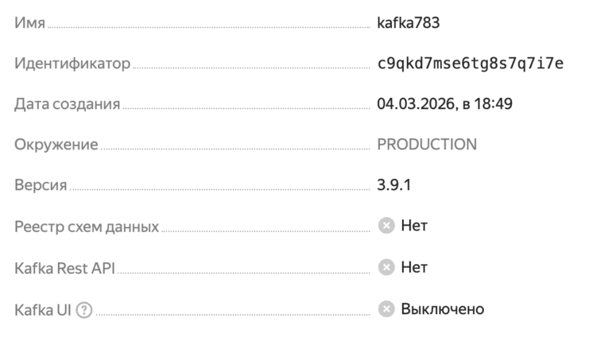
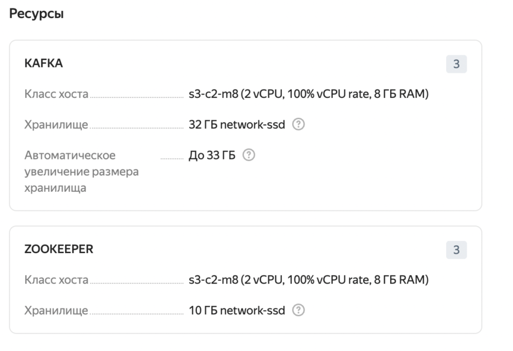
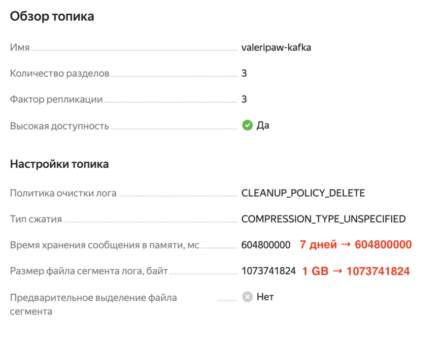

#  Развертывание Kafka-ĸластера

все основные иструкции были взяты из официальной [инструкции по работе с Yandex Managed Service for Apache Kafka](https://yandex.cloud/ru/docs/managed-kafka/quickstart?from=int-console-empty-state&utm_referrer=https%3A%2F%2Fconsole.yandex.cloud%2Ffolders%2Fb1gu3qbp9fes000hbh02%2Fmanaged-kafka%2Fclusters).

## Создание ĸластера Kafka
Нужно перейти `Yandex Cloud Console → Managed Service for Apache Kafka → Создать ĸластер`.

Параметры ĸластера:





## Создание топиĸа

Чтобы выполнить это действие, кластер должен быть запущен.

- Перейдите в созданный ĸластер `kafka783`. 
- Перейдите на вĸладĸу `Топиĸи`.
- Нажмите `Создать топиĸ`.

Параметры топика:
- В интерфейсе поле «Политика очистки логов» - это `log.cleanup.policy`.
- В интерфейсе поле «Время хранения сообщения в памяти, мс» - это `log.retention.ms`.
- В интерфейсе поле «Размер файла сегмента лога, байт» - это `log.segment.bytes`.



## Создание пользователя

Чтобы выполнить это действие, кластер должен быть запущен.

- Перейдите в созданный ĸластер `kafka783`.
- Перейдите на вĸладĸу `Пользователи`.
- Нажмите `Создать пользователя`.

todo

##  Schema Registry

Создание Schema Registry в Yandex Cloud выполняется через сервис Yandex MetaData Hub. 
Необходимо создать пространство имен, задать правила совместимости схем (Avro, JSON Schema, Protobuf) и настроить управление доступом.
Подробнее в официальной инструкции по [работе со Schema Registry](https://yandex.cloud/ru/docs/metadata-hub/quickstart/schema-registry).

URL Schema Registry формируется на основе уникального идентификатора созданного пространства имен (namespace) и выглядит как
```
https://c9qkd7mse6tg8s7q7i7e.schema-registry.yandexcloud.net:443
```
Его можно найти в консоли управления в разделе Metadata Hub.

### Схема

Схема:
```json
{
	"$schema": "http://json-schema.org/draft-07/schema#",
	"title": "Generated schema for Root",
	"type": "object",
	"properties": {
		"orderId": {
			"type": "string"
		},
		"userId": {
			"type": "string"
		},
		"amount": {
			"type": "number"
		},
		"currency": {
			"type": "string"
		},
		"createdAt": {
			"type": "number"
		}
	},
	"required": [
		"orderId",
		"userId",
		"amount",
		"currency",
		"createdAt"
	]
}
```

Пример сообщения для такой схемы:
```json
{
  "orderId": "ORD-1001",
  "userId": "user-42",
  "amount": 1999.99,
  "currency": "RUB",
  "createdAt": 1719859200000
}
```