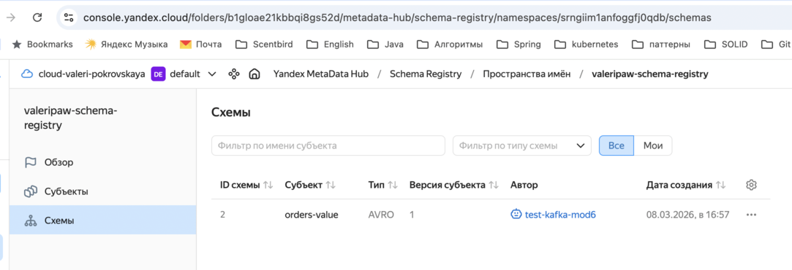
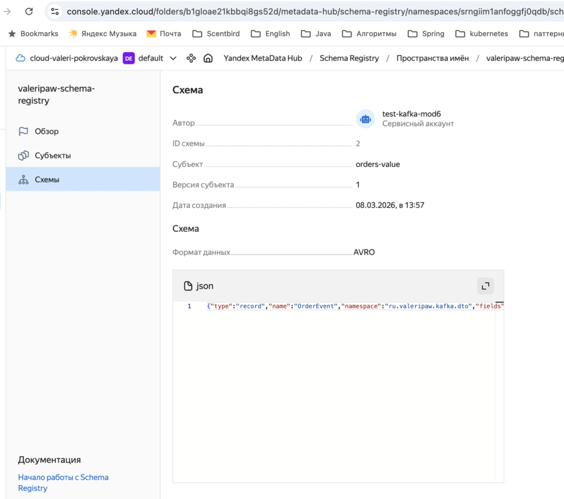
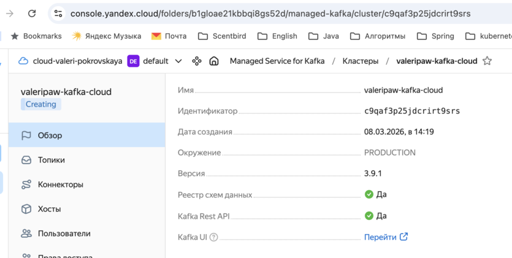
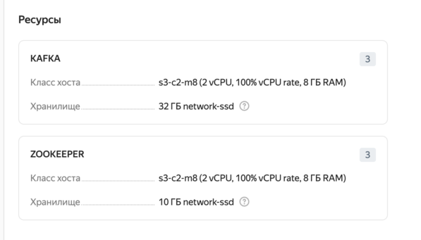
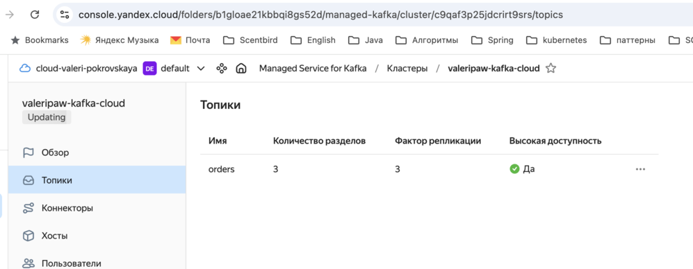
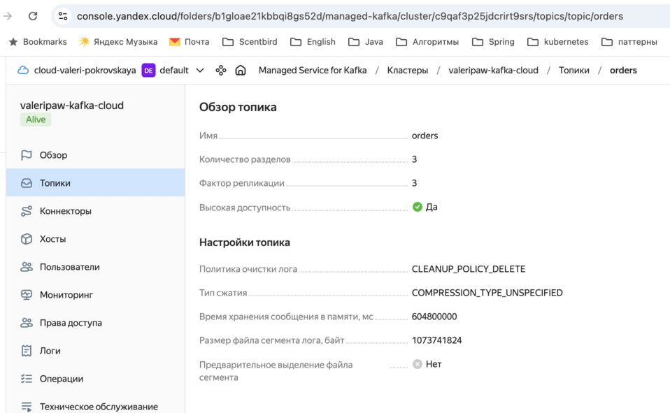
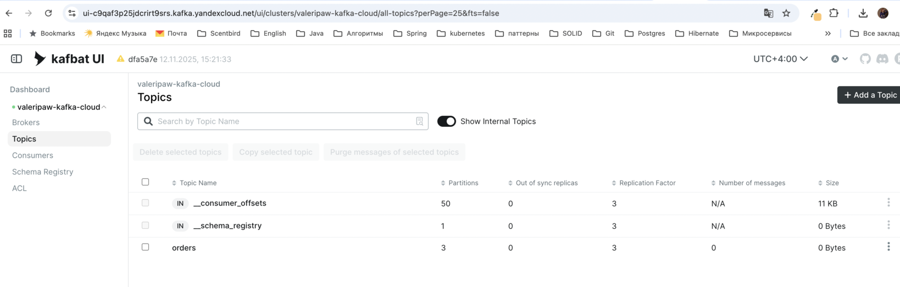
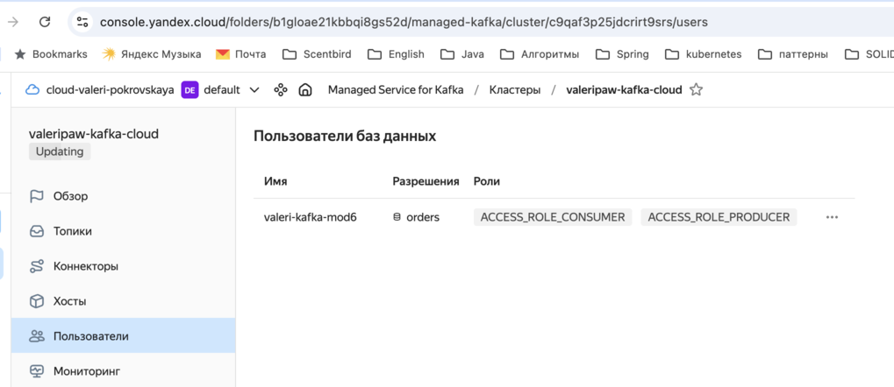
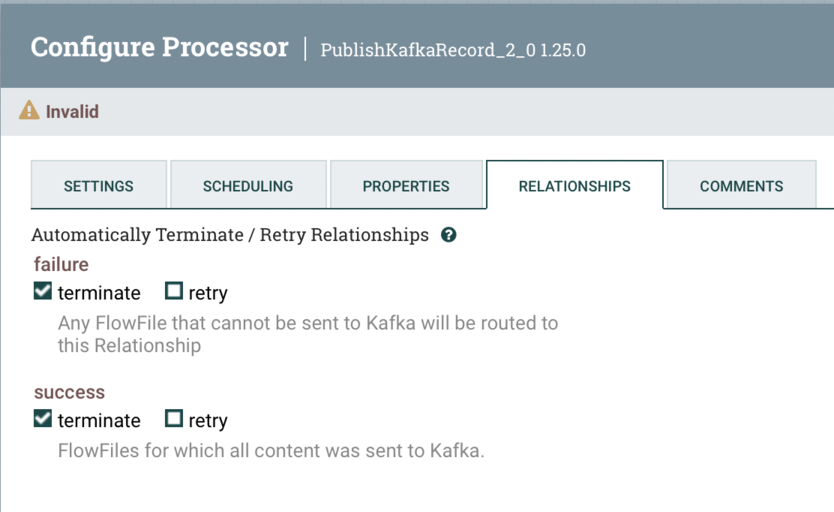
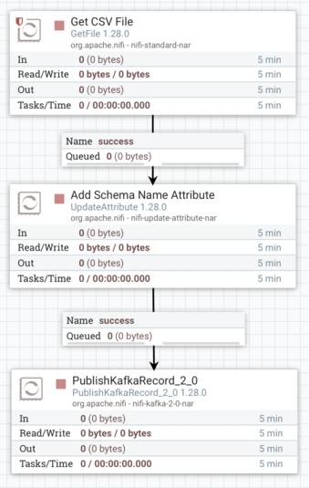

Сделанное `Задание 1.Развёртывание и настройка Kafka-кластера в Yandex Cloud` можно посмотреть на видео [part-1.mp4](video/part-1.mp4).

Сделанное `Задание 2. Интеграция Kafka с внешними системами (Apache NiFi / Hadoop)` можно посмотреть на видео [part-2.mp4](video/part-2.mp4).

# Развертывание Kafka-ĸластера

Все основные иструкции были взяты из
официальной [инструкции по работе с Yandex Managed Service for Apache Kafka](https://yandex.cloud/ru/docs/managed-kafka/quickstart?from=int-console-empty-state&utm_referrer=https%3A%2F%2Fconsole.yandex.cloud%2Ffolders%2Fb1gu3qbp9fes000hbh02%2Fmanaged-kafka%2Fclusters).

## Schema Registry

Создание Schema Registry в Yandex Cloud выполняется через сервис Yandex MetaData Hub.
Необходимо создать пространство имен, задать правила совместимости схем (Avro, JSON Schema, Protobuf) и настроить
управление доступом.
Подробнее в официальной инструкции
по [работе со Schema Registry](https://yandex.cloud/ru/docs/metadata-hub/quickstart/schema-registry).

Проверить подключение можно:

```
% curl -X GET "https://srngiim1anfoggfj0qdb.schema-registry.yandexcloud.net:443/subjects" -H "accept: application/json" --user 'api-key:'$SECRET
```

В ответе будет название:

```
["valeripaw-schema-registry"]
```

### Схема

Схема [orders.avsc](src/main/avro/orders.avsc).

Пример сообщения для такой схемы:

```json
{
  "orderId": "ORD-1001",
  "userId": "user-42",
  "amount": 1999.99,
  "currency": "RUB",
  "createdAt": 1719859200000
}
```

Регистрируем схему:

```
curl -X POST https://srngiim1anfoggfj0qdb.schema-registry.yandexcloud.net:443/subjects/orders-value/versions \
-H "Content-Type: application/vnd.schemaregistry.v1+json" \
--user 'api-key:'$SECRET \
-d '{
  "schema": "{\"type\":\"record\",\"name\":\"OrderEvent\",\"namespace\":\"ru.valeripaw.kafka.dto\",\"fields\":[{\"name\":\"orderId\",\"type\":\"string\"},{\"name\":\"userId\",\"type\":\"string\"},{\"name\":\"amount\",\"type\":\"double\"},{\"name\":\"currency\",\"type\":\"string\"},{\"name\":\"createdAt\",\"type\":\"long\"}]}"
}'
```





## Создание ĸластера Kafka

Нужно перейти `Yandex Cloud Console → Managed Service for Apache Kafka → Создать ĸластер`.

Параметры ĸластера:





## Создание топиĸа

Чтобы выполнить это действие, кластер должен быть запущен.

- Перейдите в созданный ĸластер `valeripaw-kafka-cloud`.
- Перейдите на вĸладĸу `Топиĸи`.
- Нажмите `Создать топиĸ`.

Создаем топик с именем `orders`.

Параметры топика:

- В интерфейсе поле «Политика очистки логов» - это `log.cleanup.policy`.
- В интерфейсе поле «Время хранения сообщения в памяти, мс» - это `log.retention.ms`.
- В интерфейсе поле «Размер файла сегмента лога, байт» - это `log.segment.bytes`.







## Создание пользователя

Чтобы выполнить это действие, кластер должен быть запущен.

- Перейдите в созданный ĸластер `valeripaw-kafka-cloud`.
- Перейдите на вĸладĸу `Пользователи`.
- Нажмите `Создать пользователя`.

Имя: `valeri-kafka-mod6`                     
Пароль: `7BZKzLVwALmxPii`



# Запуск приложения

Запустите приложение командой

```
docker-compose -f docker-compose-module6-cloud.yml up -d
```

Файл `docker-compose-module6-cloud.yml` лежит в корне проекта.

Подождите 1–2 минуты, пока пока поднимутся два контейнера.

## Проверка

Приложение натравлено на кафка кластер в облаке.

В приложении настроен консьюмер и продьюсер.

Для продьюсера сделан rest контроллер. Сообщение можно отправить, например, так:

```
curl -X POST localhost:9193/messages/topic \
  -H "Content-Type: application/json" \
  -d '{
  "orderId": "ORD-111",
  "userId": "user-test",
  "amount": 1999.99,
  "currency": "RUB",
  "createdAt": 1719859200000
}'
```

Консьюмер сам будет читать всё, что попадет в топик `orders`.

# Запуск NiFi

Запустите NiFi командой:

```
docker-compose -f docker-compose-nifi.yml up -d
```

Файл `docker-compose-nifi.yml` лежит в корне проекта.

Подождите 1–2 минуты, пока сервис запустится.

NiFi должен быть доступен по адресу

```
https://localhost:8443/nifi
```

Пользователь: `admin`              
Пароль: `qwerty123qwerty` (В Docker-образе NiFi используется single user login. Пароль должен быть минимум 12 символов.)

## Настройка Flow в Apache NiFi

```
GetFile
   ↓
Add Schema Name Attribute
   ↓
PublishKafkaRecord_2_0 (CSV → JSON)
```

Открываем UI и создаём процессоры: `GetFile`, `Add Schema Name Attribute` и `PublishKafkaRecord_2_0`.

### GetFile

Для `GetFile` устанавливаем:

| поле             | значение                                                                              |
|------------------|---------------------------------------------------------------------------------------|
| Input Directory  | /opt/nifi/nifi-current/input                                                          |
| Keep Source File | true                                                                                  |
| File Filter      | .*\\.csv (в некоторых версиях работает .*\.csv, можно оставить значение по умолчанию) |

В `docker-compose-nifi.yml` примонтировано:

```
  volumes:
    - ./module6/nifi:/opt/nifi/nifi-current/input
```

в `/module6/nifi` лежит тестовый `csv` файл.

### StandardSSLContextService, ConfluentSchemaRegistry, CSVReader и AvroRecordSetWriter

Для процессора `PublishKafkaRecord_2_0` нужны дополнительные настройки:

```
Record Reader:
CSVReader

Record Writer:
AvroRecordSetWriter

SSL Context Service:
StandardSSLContextService
```

В свою очередь для `CSVReader` и `AvroRecordSetWriter` нужен `ConfluentSchemaRegistry`.

Все они создаются по пути:

- нужно найти шестеренку `Settings` (у меня была слева в отдельном "окне");
- выбрать вкладку `Controller Services`
- нажать на значок плюса справа вверху `Add Controller Service`.

Для `StandardSSLContextService` устанавливаем:

| поле                | значение                                                                                                                                                       |
|---------------------|----------------------------------------------------------------------------------------------------------------------------------------------------------------|
| Truststore Filename | truststore.jks (должен лежать в /opt/nifi/nifi-current, docker-compose-nifi.yml монтируется ./module6/ca/truststore.jks:/opt/nifi/nifi-current/truststore.jks) |
| Truststore Password | qwerty                                                                                                                                                         |
| Truststore Type     | JKS                                                                                                                                                            |

Для `ConfluentSchemaRegistry` устанавливаем:

| поле                         | значение                                                         |
|------------------------------|------------------------------------------------------------------|
| Schema Registry URL          | https://srngiim1anfoggfj0qdb.schema-registry.yandexcloud.net:443 |
| request.header.Authorization | Bearer токен                                                     |

И запускаем `ConfluentSchemaRegistry`.

И для `CSVReader` и для `AvroRecordSetWriter` устанавливаем:

| поле                       | значение                   |
|----------------------------|----------------------------|
| Schema Access Strategy     | Use 'Schema Name' property |
| Schema Registry            | ConfluentSchemaRegistry    |
| Schema Name                | ${schema.name}             |
| Value Separator            | ;                          |
| Treat First Line as Header | true                       |

Для `AvroRecordSetWriter` устанавливаем:

| поле                   | значение                            |
|------------------------|-------------------------------------|
| Schema Write Strategy  | Confluent Schema Registry Reference |
| Schema Access Strategy | Use 'Schema Name' property          |
| Schema Registry        | ConfluentSchemaRegistry             |
| Schema Name            | ${schema.name}                      |

После создания `CSVReader` и `AvroRecordSetWriter` будут отключены, чтобы их включить, нужно нажать на значок молнии.

В процессоре `PublishKafkaRecord_2_0` нужно будет установить:

| поле                | значение                  |
|---------------------|---------------------------|
| Record Reader       | CSVReader                 |
| Record Writer       | AvroRecordSetWriter       |
| SSL Context Service | StandardSSLContextService |

Есть еще один путь создания `CSVReader` и `AvroRecordSetWriter`: прямо из `PublishKafkaRecord_2_0` в нужных полях
выбрать `Create new services`.
Но в этом случае всё равно придется отдельно настраивать `CSVReader` и `AvroRecordSetWriter`.

### Add Schema Name Attribute

| поле        | значение     |
|-------------|--------------|
| schema.name | orders-value |

### PublishKafkaRecord_2_0

| поле                                   | значение                                                                                                                                     |
|----------------------------------------|----------------------------------------------------------------------------------------------------------------------------------------------|
| Kafka Brokers                          | rc1a-832o9qir77b47g7g.mdb.yandexcloud.net:9091,rc1b-7864vav1e5abhngd.mdb.yandexcloud.net:9091,rc1d-t920tc533mtp4336.mdb.yandexcloud.net:9091 |
| Topic Name                             | orders                                                                                                                                       |
| Record Reader                          | CSVReader                                                                                                                                    |
| Record Writer                          | AvroRecordSetWriter                                                                                                                          |
| Use Transactions                       | false                                                                                                                                        |
| Security Protocol                      | SASL_SSL                                                                                                                                     |
| SASL Mechanism                         | SCRAM-SHA-512                                                                                                                                |
| Username (required for SASL Mechanism) | valeri-kafka-mod6                                                                                                                            |
| Password (required for SASL Mechanism) | 7BZKzLVwALmxPii                                                                                                                              |
| SSL Context Service                    | StandardSSLContextService                                                                                                                    |

Каждый процессор должен куда-то отправлять данные, и так как `PublishKafkaRecord_2_0` - финальный, проставляем
ему `Automatically Terminate Relationships` и для `success` и для `failure`.



Весь процесс выгружен в файл [csv-to-avro-kafka-cloud-flow.xml](csv-to-avro-kafka-cloud-flow.xml), из которого можно всё
восстановить.
При этом нужно будет запустить `StandardSSLContextService`, `ConfluentSchemaRegistry`, `CSVReader`
и `AvroRecordSetWriter` - они будут отключены.

Итогова схема выглядит так:


