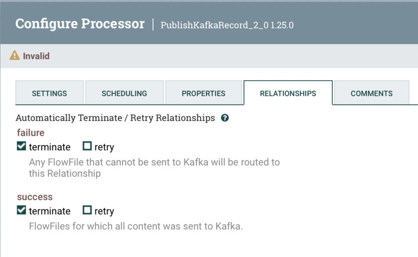

# Архитектура

```
CSV file
   ↓
GetFile
   ↓
Add Schema Name Attribute
   ↓
PublishKafkaRecord_2_0 (CSV → AVRO)
   ↓
Kafka
```

# Запуск Kafka-кластера и NiFi

Запустите kafka кластер командой:

```
docker-compose -f docker-compose-kafka6.yml up -d
```

Файл `docker-compose-kafka6.yml` лежит в корне проекта.

Подождите 1–2 минуты, пока все сервисы запустятся.

# Создание топиĸа

Создайте топик командой:

```
docker exec kafka1 kafka-topics --create \
  --topic orders \
  --bootstrap-server localhost:9092 \
  --partitions 3 \
  --replication-factor 3
```

# Запуск приложения

Запустите приложение командой

```
docker-compose -f docker-compose-module6.yml up -d
```

Файл `docker-compose-module6.yml` лежит в корне проекта.

Подождите 1–2 минуты, пока пока поднимутся два контейнера.

## Проверка

Приложение натравлено на локальный кафка кластер.

В приложении настроен консьюмер и продьюсер.

Для продьюсера сделан rest контроллер. Сообщение можно отправить, например, так:

```
curl -X POST localhost:9193/messages/topic \
  -H "Content-Type: application/json" \
  -d '{
  "orderId": "ORD-111",
  "userId": "user-test",
  "amount": 1999.99,
  "currency": "RUB",
  "createdAt": 1719859200000
}'
```

Консьюмер сам будет читать всё, что попадет в топик `orders`.

# Schema Registry

Зарегистрировать схему `orders-value` как avro можно так:

```
curl -X POST http://localhost:8081/subjects/orders-value/versions \
-H "Content-Type: application/vnd.schemaregistry.v1+json" \
-d '{
  "schema": "{\"type\":\"record\",\"name\":\"OrderEvent\",\"namespace\":\"ru.valeripaw.kafka.dto\",\"fields\":[{\"name\":\"orderId\",\"type\":\"string\"},{\"name\":\"userId\",\"type\":\"string\"},{\"name\":\"amount\",\"type\":\"double\"},{\"name\":\"currency\",\"type\":\"string\"},{\"name\":\"createdAt\",\"type\":\"long\"}]}"
}'
```

`schemaType` не указываем, тогда `Schema Registry` считает её `AVRO`.

В ответе будет что-то похожее на:

```json
{
  "id": 1,
  "version": 1,
  "guid": "9bc60930-ea71-4305-4a05-c5a35ace3010",
  "schemaType": "AVRO",
  "schema": "{\"type\":\"record\",\"name\":\"OrderEvent\",\"namespace\":\"ru.valeripaw.kafka.dto\",\"fields\":[{\"name\":\"orderId\",\"type\":\"string\"},{\"name\":\"userId\",\"type\":\"string\"},{\"name\":\"amount\",\"type\":\"double\"},{\"name\":\"currency\",\"type\":\"string\"},{\"name\":\"createdAt\",\"type\":\"long\"}]}"
}
```

# NiFi

NiFi должен быть доступен по адресу

```
https://localhost:8443/nifi
```

Пользователь: `admin`              
Пароль: `qwerty123qwerty` (В Docker-образе NiFi используется single user login. Пароль должен быть минимум 12 символов.)

## Настройка Flow в Apache NiFi

```
GetFile
   ↓
Add Schema Name Attribute
   ↓
PublishKafkaRecord_2_0 (CSV → JSON)
```

Открываем UI и создаём процессоры: `GetFile`, `Add Schema Name Attribute` и `PublishKafkaRecord_2_0`.

### GetFile

Для `GetFile` устанавливаем:

| поле             | значение                                                                              |
|------------------|---------------------------------------------------------------------------------------|
| Input Directory  | /opt/nifi/nifi-current/input                                                          |
| Keep Source File | true                                                                                  |
| File Filter      | .*\\.csv (в некоторых версиях работает .*\.csv, можно оставить значение по умолчанию) |

В `docker-compose-kafka6.yml` примонтировано:

```
  volumes:
    - ./module6/nifi:/opt/nifi/nifi-current/input
```

в `/module6/nifi` лежит тестовый `csv` файл.

### ConfluentSchemaRegistry, CSVReader и AvroRecordSetWriter

Для процессора `PublishKafkaRecord_2_0` нужны дополнительные настройки:

```
Record Reader:
CSVReader

Record Writer:
AvroRecordSetWriter
```

В свою очередь для `CSVReader` и `AvroRecordSetWriter` нужен `ConfluentSchemaRegistry`.

Все они создаются по пути:

- нужно найти шестеренку `Settings` (у меня была слева в отдельном "окне");
- выбрать вкладку `Controller Services`
- нажать на значок плюса справа вверху `Add Controller Service`.

Для `ConfluentSchemaRegistry` устанавливаем:

| поле                | значение                    |
|---------------------|-----------------------------|
| Schema Registry URL | http://schema-registry:8081 |

И запускаем `ConfluentSchemaRegistry`.

И для `CSVReader` и для `AvroRecordSetWriter` устанавливаем:

| поле                       | значение                   |
|----------------------------|----------------------------|
| Schema Access Strategy     | Use 'Schema Name' property |
| Schema Registry            | ConfluentSchemaRegistry    |
| Schema Name                | ${schema.name}             |
| Value Separator            | ;                          |
| Treat First Line as Header | true                       |

Для `AvroRecordSetWriter` устанавливаем:

| поле                   | значение                            |
|------------------------|-------------------------------------|
| Schema Write Strategy  | Confluent Schema Registry Reference |
| Schema Access Strategy | Use 'Schema Name' property          |
| Schema Registry        | ConfluentSchemaRegistry             |
| Schema Name            | ${schema.name}                      |

После создания `CSVReader` и `AvroRecordSetWriter` будут отключены, чтобы их включить, нужно нажать на значок молнии.

В процессоре `PublishKafkaRecord_2_0` нужно будет установить:

| поле          | значение            |
|---------------|---------------------|
| Record Reader | CSVReader           |
| Record Writer | AvroRecordSetWriter |

Есть еще один путь создания `CSVReader` и `AvroRecordSetWriter`: прямо из `PublishKafkaRecord_2_0` в нужных полях
выбрать `Create new services`.
Но в этом случае всё равно придется отдельно настраивать `CSVReader` и `AvroRecordSetWriter`.

### PublishKafkaRecord_2_0

| поле             | значение                               |
|------------------|----------------------------------------|
| Kafka Brokers    | kafka1:19092,kafka2:19093,kafka3:19094 |
| Topic Name       | orders                                 |
| Record Reader    | CSVReader                              |
| Record Writer    | AvroRecordSetWriter                    |
| Use Transactions | false                                  |

Каждый процессор должен куда-то отправлять данные, и так как `PublishKafkaRecord_2_0` - финальный, проставляем
ему `Automatically Terminate Relationships` и для `success` и для `failure`.



Весь процесс выгружен в файл [csv-to-json-kafka-flow.xml](csv-to-json-kafka-flow.xml), из которого можно будет
восстановить весь процесс.
При этом нужно будет запустить `ConfluentSchemaRegistry`, `CSVReader` и `AvroRecordSetWriter` - они будут отключены.

# Остановка кластера

1. Остановите кластер командой:

```
docker-compose down
```

2. Для полной очистки (включая данные) можно использовать команду:

```
docker-compose down -v
```
